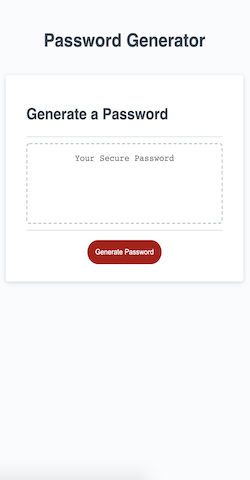
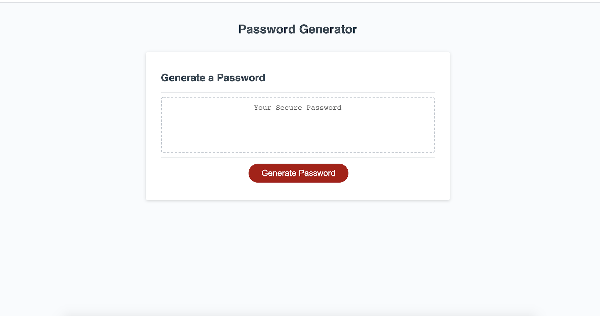

# Password-Generator
### Table of Content
1. [Project Context - User Story](#context)
2. [ Project Objectives ](#objectives)
3. [ Outcome ](#Outcome)
4. [ Project Links ](#Links)
5. [ Screenshots ](#Screenshots)
6. [Pseudocode - Logic Steps](#Pseudocode)
7. [ Installation](#Installation)
8. [ Credits](#Credits)
9. [What I've Learned](#learned)
10. [ License ](#License)
#

### 1. Project Context - User Story
* Strong passwords are the first line of defense in protecting business data and customer information. However, most of us have trouble memorizing strong passwords filled with special symbols and random characters. Therefore, we often choose the same password for multiple personal and business accounts, or we create simpler ones that are easy to crack. 
* Employees who have access to high-sensitive data might share their login information with others
* It is important for companies to implement a secure password policy such as generating strong random passwords that provides greater security.

### 2. Project Objectives
* Create an application that generates a random password based on user-selected criteria (numbers, uppercase letters, lowercase letters and symbols).
* This app will run in the browser and feature dynamically updated HTML and CSS powered by JavaScript code. 
* The password is either displayed in an alert or written to the page
* It will also feature a clean and polished user interface and be responsive, ensuring that it adapts to multiple screen sizes.(I used the given HTML & CSS files mostly)

### 3. Outcome
* The user interface is responsive to different devices - mobile, tablets, laptops and larger screen desktops
* The app is dynamic and generates a random password based on user preference

### 4. Links 

#### Link to Website
https://imbingz.github.io/Password-Generator/

#### Link to Files 
https://github.com/imbingz/Password-Generator/

### 5. Screenshots 

#### Screenshots - Mobile View
<kbd></kbd>

####  Screenshots - Laptop view 
<kbd></kbd>

### 6. Pseudocode - Logic Steps
#### Step 1
After the 'click' event, the users will be prompted to enter the password length. So create a variable that holds the users input. 
#### Step 2
Check if the users input is a number between 8 and 128. If not(such as letters, null, space, symbols, or numbers out of range), keep prompting until the input is as desired. 
#### Step 3
Ask users whether they would like their passwords to contain numbers, uppercase letters, lowercase letters and symbols. Create a variable to hold each answer (yes=true; no=false). If users select no to all questions, then alert "They must select at least one", and iterate the set of questions again until at least one is chosen. 
#### Step 4
Create a variable that holds the sum of user preference (if yes to any of the options, add those characters to the variable)
#### Step 5
Generate random numbers as index to choose the character randomly. 
#### Step 6
Run the step 5 for the same number of times as the password length input by the users 
#### Step 7
Create a variable that holds the sum of those random characters. 
#### Step 8
Add the above all together and iterate 

### 7. Installation
* Access to GitHub.com and a code editor such as vscode is necessary
* Go to [github.com/imbingz/imbingz.github.io.](https://github.com/imbingz/Responsive-Website-Portfolio)
* Click on the green button that says Clone or Download
* Choose how you would like to download: using the SSH/HTTPS keys or download the zip file
* Using SSH/HTTPS Key: You will copy the link shown and open up either terminal (mac: pre-installed) or gitbash (pc: must be installed). Once the application is open, you will type git clone paste url here. Once you have cloned the git repo, cd into the repo and type open. to open the folder which contains all files used for the website. Once inside the folder, click on index.html to open the website in the browser.
* Using Download ZIP: Click on Download Zip. Locate the file and double click it to unzip the file. Locate the unzipped folder and open it. All the files for the website will be within this folder. Click on index.html to open the website in the browser.

### 8. Credits:
I would like to thank my TA Katie @fkakatie for her guidance and efforts to help me understand the landscape of this project and some of the aspects I need to consider and learn more about before even starting to build anything. I also want to thank my fellow coder Kyle Murray @theykay who took time helping me fix a bug in my original code after a day of searching for a solution. The following materials contribute to the completion of this project too. 

* [Password Special characters - www.owasp.org](https://owasp.org/www-community/password-special-characters)
* [Random password generator - www.wikipedia.org](https://en.wikipedia.org/wiki/Random_password_generator)
* [How To Create A Strong Password - www.pcmag.com](https://www.pcmag.com/how-to/how-to-create-a-random-password-generator)

### 9. What I've Learned
* Understanding the user story and objectives: WHY I need to build this app and what problem this app can solve is critical for me to proceed.
* Using plain english to go through each step of users action and interaction before starting to code not only helped me look through my "tool box" for this app, but also helped boost my confidence. :)
* Working with a team is one of the best ways to learn. I like to hear how others approach the same problems from different angles and often than not, I'll find some flaws or gaps in my own logic and look for ways to make my solutions better and sound. 
* Testing and iterating are absolutely a MUST. I was pretty confident that my app was bulletproof (since everything looked fine in the console as I was coding) until I tested it on the deployed site. Yes, I found bugs. 
* In the future maybe it is worth trying how to improve the security level of the random password by adding encryption methods, or making it into a different user interface such as checkboxes instead of prompts. 

### 9. License
##### MIT License

Copyright (c) [2020] [bingzhang]

Permission is hereby granted, free of charge, to any person obtaining a copy of this software and associated documentation files (the "Software"), to deal in the Software without restriction, including without limitation the rights to use, copy, modify, merge, publish, distribute, sublicense, and/or sell copies of the Software, and to permit persons to whom the Software is furnished to do so, subject to the following conditions:

The above copyright notice and this permission notice shall be included in all copies or substantial portions of the Software.

THE SOFTWARE IS PROVIDED "AS IS", WITHOUT WARRANTY OF ANY KIND, EXPRESS OR IMPLIED, INCLUDING BUT NOT LIMITED TO THE WARRANTIES OF MERCHANTABILITY, FITNESS FOR A PARTICULAR PURPOSE AND NON-INFRINGEMENT. IN NO EVENT SHALL THE AUTHORS OR COPYRIGHT HOLDERS BE LIABLE FOR ANY CLAIM, DAMAGES OR OTHER LIABILITY, WHETHER IN AN ACTION OF CONTRACT, TORT OR OTHERWISE, ARISING FROM, OUT OF OR IN CONNECTION WITH THE SOFTWARE OR THE USE OR OTHER DEALINGS IN THE SOFTWARE.

August 5, 2020.

